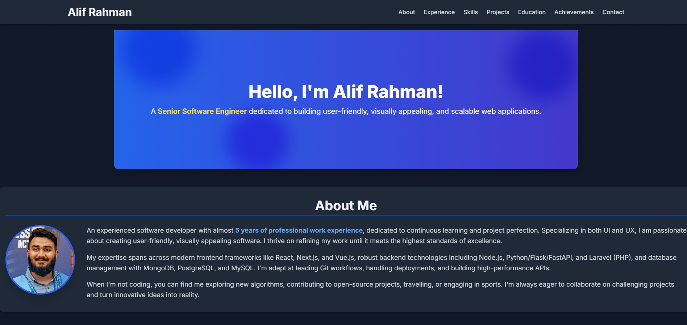

# Alif Rahman — Senior Software Engineer Portfolio



Personal portfolio website of **Alif Rahman**, a Senior Software Engineer specializing in high-scale backend architectures and modern frontend experiences.

The site is a React single-page app. Content (experience, skills) is static; **projects** and **certifications** are loaded from **Firebase Firestore** with a built-in static fallback, and the **contact form** + **visitor counter** are backed by Firebase.

## ✨ Features

- **Hero, Experience timeline, Skills, Projects, Education & Certifications, Contact** sections
- **Dynamic projects & certifications** from Firestore, with graceful fallback to static data
- **Working contact form** — submissions stored in Firestore (`messages`)
- **Live visitor counter** in the footer (Firestore `stats/visitors`)
- **Inline-scrolling certifications** list (shows ~3 at a time)
- **Downloadable CV** (`VIEW RESUME` → `src/assets/AlifRahmanCV.pdf`)
- **Light, modern theme** with glassmorphism accents
- **Responsive** across mobile, tablet, and desktop
- **SEO/social meta** + inline "AR" favicon

## 🛠️ Tech Stack

- **React 19** + **Vite 7**
- **Tailwind CSS 3** (base/reset layer via PostCSS)
- **Firebase 11** — Firestore (data) + Anonymous Auth (write access)
- Deployed to **GitHub Pages** (`gh-pages`), optionally **Firebase Hosting**

## 📦 Project Structure

```
Alif_Rahman/
├── public/                 # (empty) static assets copied to dist
├── src/
│   ├── assets/             # images, CV pdf
│   ├── components/         # Nav, Hero, Experience, Skills, Projects,
│   │                       #   Education, Contact, ContactForm, Footer
│   ├── App.jsx            # composes sections, boots Firebase auth
│   ├── firebase.js        # Firebase init + addMessage / incrementVisitors
│   ├── hooks.js           # useProjects / useCerts / useVisitorCount
│   ├── data.js            # static fallback for projects & certs
│   ├── index.css          # Tailwind + component styles
│   └── main.jsx           # React entry
├── index.html             # HTML shell (meta, favicon)
├── firebase.json          # Hosting (dist) + Firestore rules
├── firestore.rules        # security rules
├── vite.config.js         # base: /Alif_Rahman/ + firebase chunk split
└── package.json
```

## 🚀 Getting Started

### Prerequisites
- Node.js (LTS) and npm

### Install & Run
```bash
npm install
npm run dev      # http://localhost:5173
```
Firebase uses the hardcoded project config by default; for local overrides, copy `.env.local` (see below).

### Scripts
| Script | Description |
| --- | --- |
| `npm run dev` | Vite dev server |
| `npm run build` | Production build into `dist/` |
| `npm run preview` | Preview the production build |
| `npm run lint` | ESLint (zero-warning policy) |
| `npm run deploy` | Build + publish `dist/` to GitHub Pages (`gh-pages`) |

## 🔥 Firebase Backend Setup

The site works out-of-the-box using static fallback data. To enable the dynamic features:

1. **Enable Anonymous Authentication** in the Firebase console: *Authentication → Sign-in method → Anonymous → Enable*.
2. **Deploy the security rules** (once):
   ```bash
   firebase deploy --only firestore:rules
   ```
3. **Seed your data** (optional — without it the site shows the static fallback):
   - `projects` collection — docs with `name, description, link, tag, icon?, order` (number)
   - `certs` collection — docs with `name, issuer, link, status?, order` (number)
   - `stats/visitors` doc — `{ count: 0 }` (auto-increments on visit)

The contact form writes to `messages`; its rules only allow authenticated `create` with the expected string fields and block reads.

### Local env overrides (optional)
Create `.env.local` (gitignored) to point at a different project — values fall back to the deployed config when absent:
```
VITE_FIREBASE_API_KEY="..."
VITE_FIREBASE_AUTH_DOMAIN="..."
VITE_FIREBASE_PROJECT_ID="..."
VITE_FIREBASE_STORAGE_BUCKET="..."
VITE_FIREBASE_MESSAGING_SENDER_ID="..."
VITE_FIREBASE_APP_ID="..."
```

## 🌐 Deployment

- **GitHub Pages (canonical):** `npm run deploy` builds and pushes `dist/` to the `gh-pages` branch. `vite.config.js` sets `base: '/Alif_Rahman/'` so assets resolve on the subpath.
- **Firebase Hosting (optional):** the `.github/workflows/firebase-hosting-*.yml` workflows deploy `dist/` on merge / PR preview when the `FIREBASE_SERVICE_ACCOUNT_*` secret is present. `firebase.json` serves `dist` and references `firestore.rules`.

## ⚠️ Updating Content

- **Experience / Skills:** edit the arrays in `src/components/Experience.jsx` and `src/components/Skills.jsx`.
- **Projects / Certifications:** add docs to the Firestore `projects` / `certs` collections (preferred), or edit the fallback arrays in `src/data.js`.
- **CV:** replace `src/assets/AlifRahmanCV.pdf`.

## 📞 Contact

- **Email**: alif.rahman.c@gmail.com
- **LinkedIn**: [linkedin.com/in/alifsrse](https://linkedin.com/in/alifsrse)
- **GitHub**: [github.com/AlifSrSE](https://github.com/AlifSrSE)

## 📄 License

MIT License.
